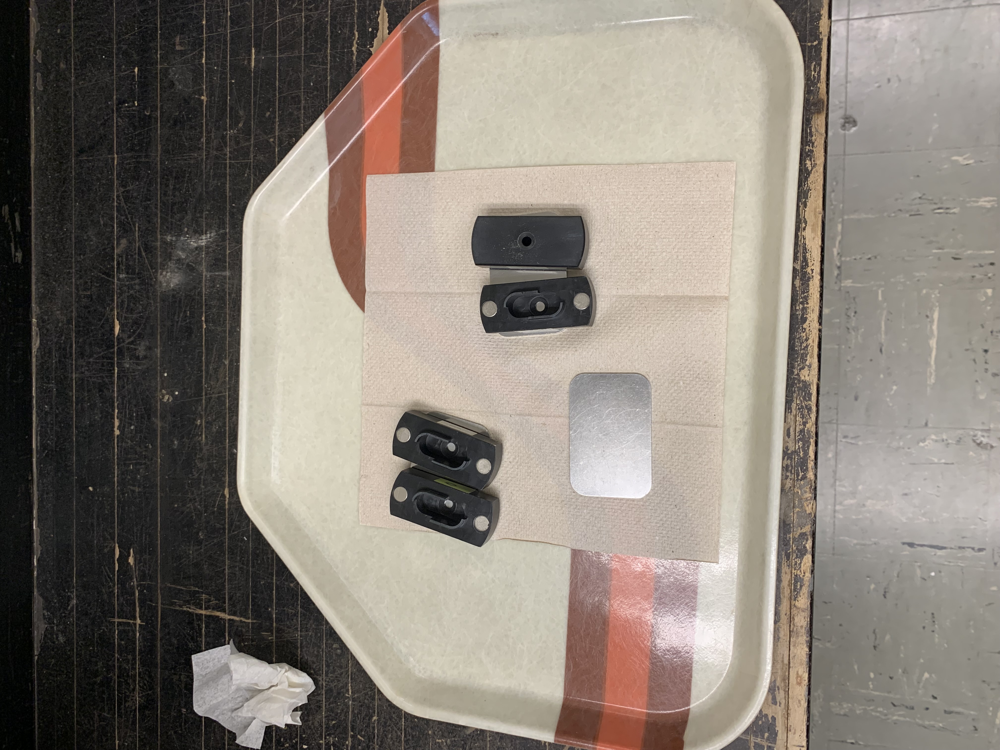
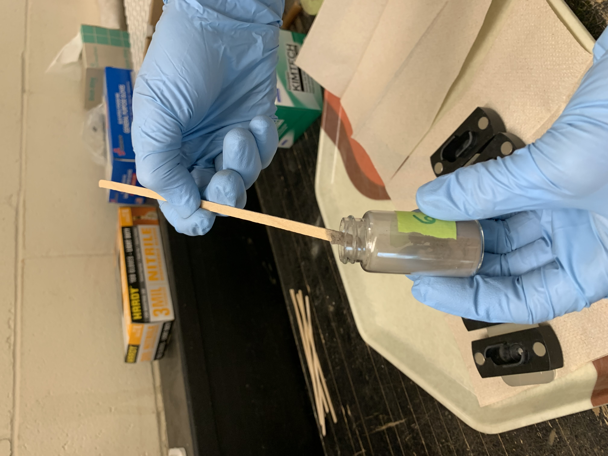
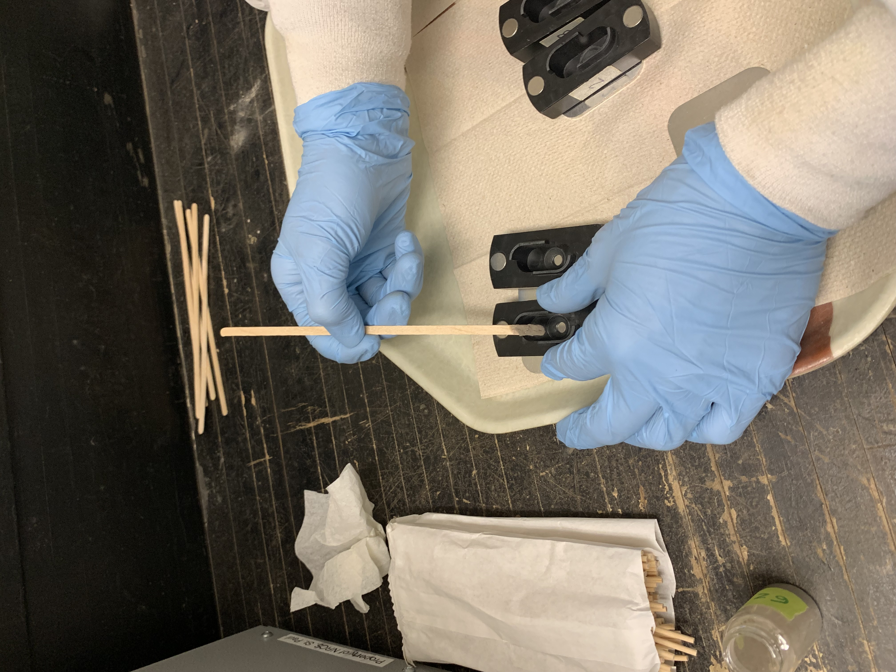
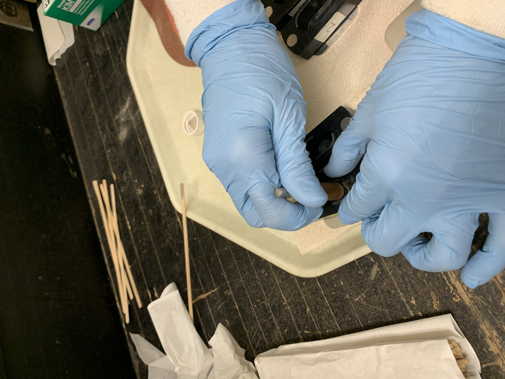
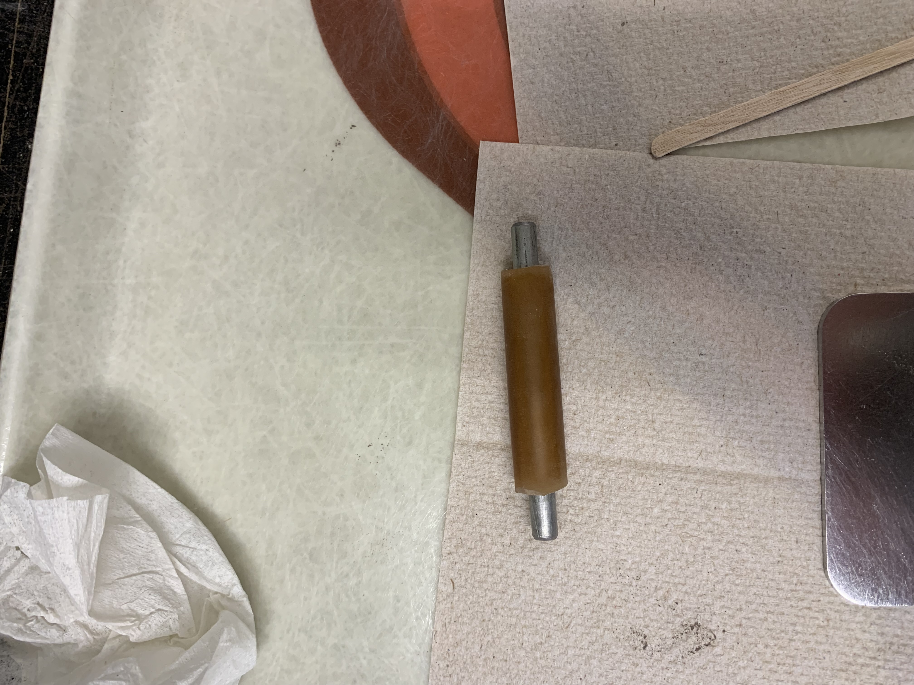
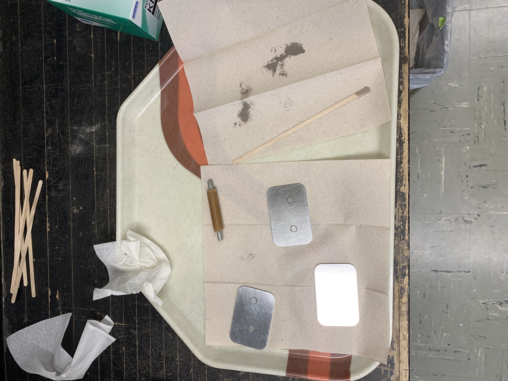
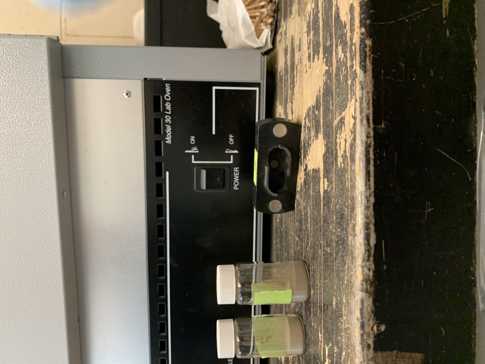

# Mid-infrared Spectroscopy (MIR)

::: callout-note
Last edited: 24SEP2026 NBP

This section is not intended to be a standalone protocol, but rather notes to go along with the NRCS MIR Laboratory Instructions - version 7, as of May 2025. That protocol contains instructions for ball milling samples and using the Bruker Alpha II MIR. Samples must be milled prior to being scanned. The NRCS MIR protocol can be found in the Jelinski Lab shared drive - [mir-materials-30JUN2025](https://drive.google.com/drive/folders/1F8cBljSTZ04SoSvJfbvu0if4E3mGpQP3?usp=drive_link). If you are not a member, please email Nic Jelinski.

Many thanks to Aidan Brousseau for his time spent running and troubleshooting this machine and for his excellent protocol!
:::

## Materials
-   4 black plastic sample puck holders with magnets
-   Small flat aluminum plates
-   Small metal plunger
-   Larger tray to place prepped samples on
-   Wooden stir stick or skinny metal scoop
-   Bruker Alpha II FT-IR spectrometer
-   Computer with OPUS application installed
-   Gold plated mirror reference (should remain on MIR)
-   Prepared soil samples

## Data Folders and Sheets
- MIR Data Folder - <https://drive.google.com/drive/folders/1C-gboLXdwW_f3k_-qGQlFLGNMEj9ZElO?usp=drive_link>
- MIR Final Data Sheet - <https://docs.google.com/spreadsheets/d/1ny4SEYO-J2b6NCI2dJDAP7ohfHQTtgfL8Ht7Wa5-GTk/edit?usp=drive_link>

## Setup

- The MIR unit needs to be plugged into an ethernet cable which goes into a cable that changes the IP address, which goes into the computer - it can only be used with a designated computer.
- Let the MIR warm up for 30 minutes prior to turning on the computer.
- When the OPUS software is first opened, it will automatically run an OVP test. This takes 5-7 minutes.
- Pay attention to the indicator light in the bottom right corner of the OPUS software.
  - Gray: computer and MIR are not communicating correctly.
  - Yellow: computer and MIR are communicating, but a PQ test needs to be run.
  - Green: MIR is ready to scan samples.
- Runs PQ test (performance qualification). Measure BG (background) with reference on there (should always be on).
  - PQ test will tell say if the desiccant needs to be changed; if the humidity is over 30%, replace desiccant. 
- Look at measurement settings. Should be on Region 5 (data from Salina, KS), if not do it through the advanced tab.
- Sample description is the sample code and file name.
- In the advanced menu, there is some information describing the parameters, but know that scans are already set up for how UMN will use it (parameters are for Salina, KS). Resulting spectrum is in absorbance.
- To run samples, choose measure → setup measurement parameters. See NRCS protocol. Once set up, run samples by choosing measure -> routine measurement, or click the green test tube icon. 
- Toggle back and forth between background and sample single channel.
- In every routine measurement window, users change the sample description, nothing else.

## Packing and Running Samples

- You must wear a mask and gloves while packing and running samples.
- 4 replicates for each sample: pack each sample in the black sample holders 4 times.

{#fig-sampleholders}

- Using a long narrow tongue depressor (sample holder), scoop a fingernail sized amount of sample from the scintillation vial into the well in the black sample holder

{#fig-tonguedepressor} {#fig-sampleintoholder}

- Use the sample pusher to firmly press the sample into the well

{#fig-stamping} {#fig-samplepusher}

- Tap the sample holder on your discard paper towel

{#fig-packingstation} {#fig-sidewaysholder}

- Note that in the top photo (above) the clean black sample holders are placed on silver trays. Keep them on the silver trays while packing. Do not lift the holder up before you've packed down the sample or it will all fall out
- Gently place the black holder onto the MIR. It's attached by a magnet, so you don't have to worry about it being in the right place. Don't let it slam onto the MIR or the sample could fall out
- Open routine measurement → add sample name (description)
- Will scan and scan until it gets to 128 accepted scans; you shouldn't have more than 25 rejected scans
  - After the scan is done, the software doesn't show you how many rejected scans there are. That's okay.
  - If you notice more than 25, consider rerunning the sample. Drea explained it as follows: If you have 26 rejections, that's okay. The MIR still got 120 acceptable scans! If it's higher, you can compare the spectra and if they are similar enough, that's probably okay. If not, rerun the sample and follow the same steps. If the results are the same (ie, the steps are telling you to rerun it again), then that could be how the soil is. Drea mentioned some red Kentucky soils that were not running well.
- Flip black sample holder down once the sample has been scanned
- Run the background reference between each sample, even between the four replicates of your samples. This was written in a 2023 training, but as of 2026, UMN has only been running the reference between unique samples, not the replicates of each.
- To show samples: right click, scale all spectra, show everything.
- Wipe each black sample holder with a kimwipe between each new sample. That way, there's no confusion about which sample is in which sample holder. One sample number in all four of the sample holders.
  - Use a long Q-tip to get the kimwipe into the well
  - Drea rinses the black sample holders once a week
- Every couple samples, either shake out or replace your paper towels

## Exporting

- Software automatically saves each file to the external hard drive, so you can email them from there. Zip into a folder.
- Having a difficult time opening the files on mac when they are emailed as is.

## Humidity Mitigation
- Empty the humidifier in Borlaug 198 periodically.
- Begin checking the humidity percent on the MIR after one month has passed since its last replacement. Click round indicator light in bottom right of OPUS software. Choose interferometer to read scanner diagnostics; look for relative humidity IF compartment (%). It needs to be replaced at 30% humidity.

## Troubleshooting

- If the software shows the wrong display, meaning the menus look different, change the workplace display back to alpha II full access.

- If the software doesn't have the Salina, KS parameters setup, the scanning lengths etc will be wrong. You can reset them manually - page 10-11 steps 34-36 of the NRCS protocol.
