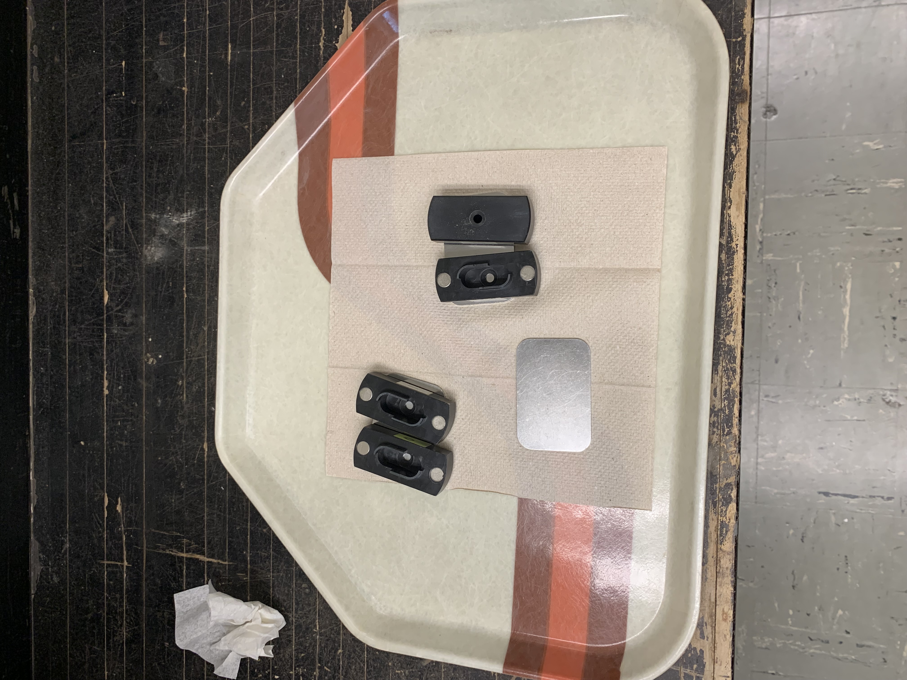
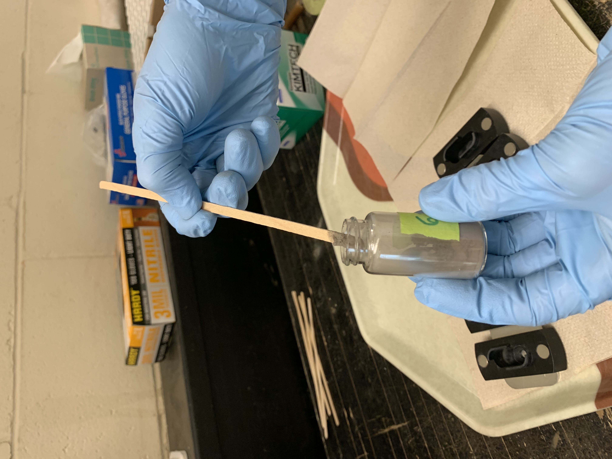
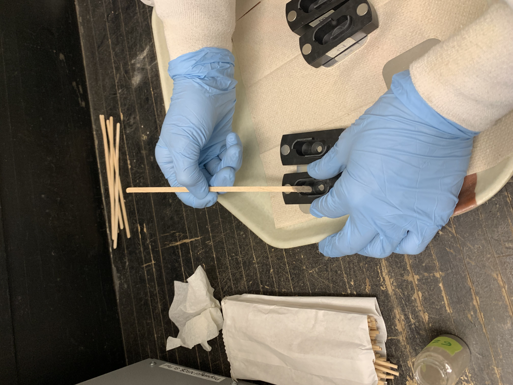
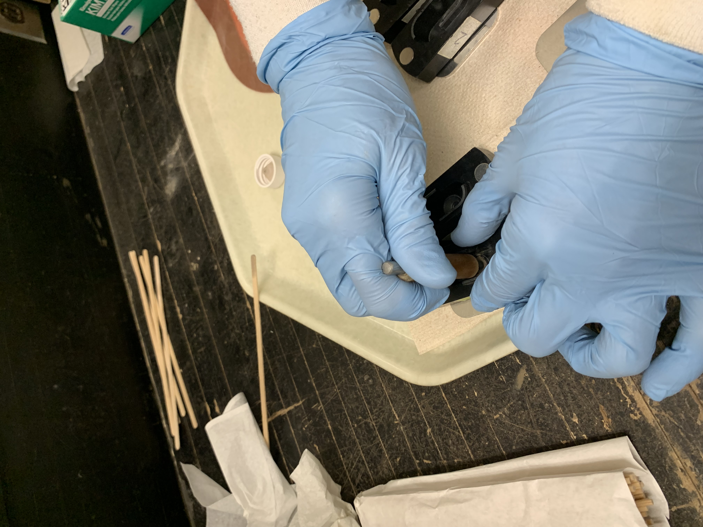
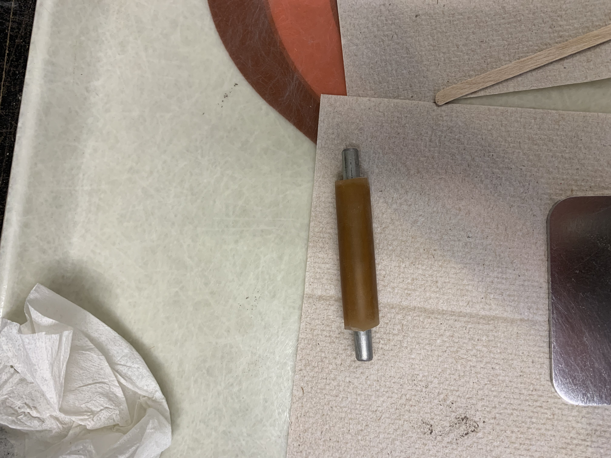
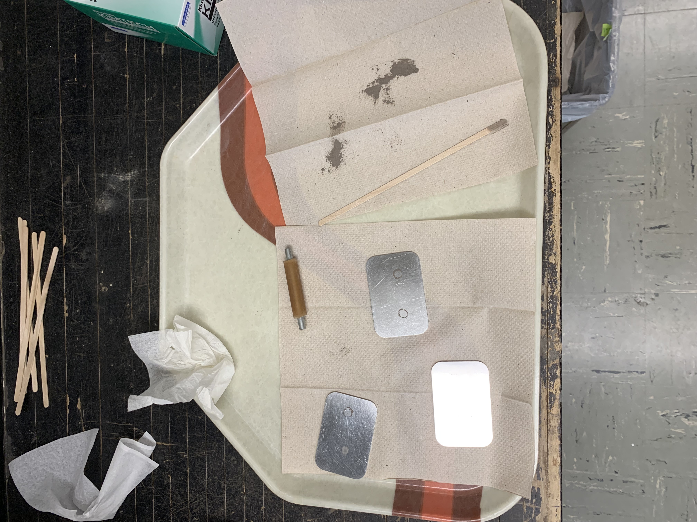
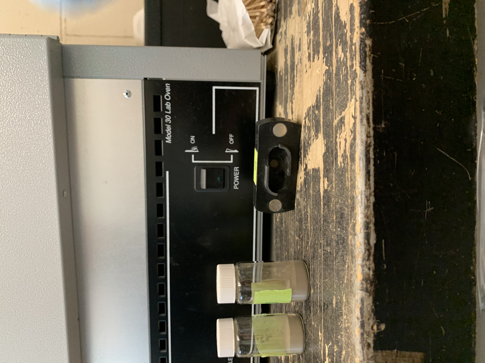

# Mid-infrared Spectroscopy (MIR)

::: {callout-note}
Last edited: 24SEP2026 NBP

This section is not intended to be a standalone protocol, but rather notes to go along with the NRCS MIR Laboratory Instructions - version 7, as of May 2025. That protocol contains instructions for ball milling samples and using the Bruker Alpha II MIR. Samples must be milled prior to being scanned. The NRCS MIR protocol can be found in the Jelinski Lab shared drive - [mir-materials-30JUN2025](https://drive.google.com/drive/folders/1F8cBljSTZ04SoSvJfbvu0if4E3mGpQP3?usp=drive_link). If you are not a member, please email Nic Jelinski.

Many thanks to Aidan Brousseau for his time spent running and troubleshooting this machine and for his excellent protocol!
:::

## Materials

- 4 black plastic sample puck holders with magnets
- Small flat aluminum plates
- Small metal plunger
- Larger tray to place prepped samples on
- Wooden stir stick or skinny metal scoop
- Bruker Alpha II FT-IR spectrometer
- Computer with OPUS application installed
- Gold plated mirror reference (should remain on MIR)
- Prepared soil samples

## Data Folders and Sheets

- MIR Data Folder - <https://drive.google.com/drive/folders/1C-gboLXdwW_f3k_-qGQlFLGNMEj9ZElO?usp=drive_link>
- MIR Final Data Sheet - <https://docs.google.com/spreadsheets/d/1ny4SEYO-J2b6NCI2dJDAP7ohfHQTtgfL8Ht7Wa5-GTk/edit?usp=drive_link>

## Setup

- The MIR unit needs to be plugged into an ethernet cable which goes into a cable that changes the IP address, which goes into the computer - it can only be used with a designated computer.
- Let the MIR warm up for 30 minutes prior to turning on the computer.
- When the OPUS software is first opened, it will automatically run an OVP test. This takes 5-7 minutes.
- Pay attention to the indicator light in the bottom right corner of the OPUS software.
  - Gray: computer and MIR are not communicating correctly.
  - Yellow: computer and MIR are communicating, but a PQ test needs to be run.
  - Green: MIR is ready to scan samples.
- Runs PQ test (performance qualification). Measure BG (background) with reference on there (should always be on).
  - PQ test will tell say if the desiccant needs to be changed; if the humidity is over 30%, replace desiccant.
- Look at measurement settings. Should be on Region 5 (data from Salina, KS), if not do it through the advanced tab.
- Sample description is the sample code and file name.
- In the advanced menu, there is some information describing the parameters, but know that scans are already set up for how UMN will use it (parameters are for Salina, KS). Resulting spectrum is in absorbance.
- To run samples, choose measure → setup measurement parameters. See NRCS protocol. Once set up, run samples by choosing measure -\> routine measurement, or click the green test tube icon.
- Toggle back and forth between background and sample single channel.
- In every routine measurement window, users change the sample description, nothing else.

## Packing and Running Samples

- A mask and gloves must be worn while packing and running samples, especially if using the dift accessory.
- 4 replicates should be prepared for each sample: pack a subset of each sample in the four black sample holders.
- Using a long narrow tongue depressor (sample holder), scoop a fingernail sized amount of sample from the scintillation vial into the well in the black sample holder.
- Use the sample pusher to firmly press the sample into the well.
- Tap the sample holder on your discard paper towel.

{#fig-sampleholders}

{#fig-tonguedepressor} {#fig-sampleintoholder}

{#fig-stamping} {#fig-samplepusher}

{#fig-packingstation} {#fig-sidewaysholder}

- Note that in the top photo (above) the clean black sample holders are placed on silver trays. Keep them on the silver trays while packing. Do not lift the holder up before the sample has been packed down or it will all fall out.
- Gently place the black holder onto the MIR. It's attached by a magnet, so operators should not stress about exact placement. Don't let it slam onto the MIR or the sample could fall out.
- Open routine measurement → add sample name (description).
- The MIR will scan until it reaches 128 accepted scans; monitor the number of rejections closely, especially in the first 30 seconds. Samples should not have more than 25 rejected scans.
  - After the scan is done, the software doesn't show users how many rejected scans there are. That's okay.
  - If there are more than 25 rejections, consider rerunning the sample. Drea explained it as follows: If there are 26 rejections, that's okay. The MIR still got 120 acceptable scans! If it's higher, users can compare the spectra and if they are similar enough, that's probably okay. If not, rerun the sample and follow the same steps. If the results are the same (ie, the steps are telling the user to rerun it again), then that could be how the soil is. Drea mentioned some red Kentucky soils that were not running well.
- Flip black sample holder down once the sample has been scanned to keep track.
- Run the background reference between each sample, even between the four replicates of your samples. This was written in a 2023 training, but as of 2026, UMN has only been running the reference between unique samples, not the replicates of each.
- To show samples: right click, scale all spectra, show everything.
- Wipe each black sample holder with a kimwipe between each new sample. That way, there's no confusion about which sample is in which sample holder. One sample number in all four of the sample holders.
  - Use a long Q-tip to get the kimwipe into the well.
  - Drea rinses the black sample holders once a week.
- Every couple samples, either shake out or replace the paper towels or Kim wipes on the tray.

## Drift Accessory

The drift accessory works the exact same as the normal samples other than the sample prep and region. **However, it is very important to wear gloves while using the drift accessory because your fingers will damage the gold plated mirror.** Below are the steps to use the Drift accessory for the Alpha II MIR:

1.  Wearing gloves remove the normal attachment for the MIR by pushing down on the gray tab at the top of the machine and sliding it towards you carefully. Place that attachment on a piece of clean paper. These are located in the drawer below the MIR.

2.  Remove the blue box from the box and place it on the sample prep tray and remove the drift accessory from the box with orange markings sitting against the wall in Borlaug 198. Place this on the machine by aligning the black tabs on the back of the drift into the holes on the MIR and pushing down on the grey tab once again. The light on the MIR will go from red to orange if done correctly.

3.  Open the little blue box and inside there is a small gold plated mirror. Align the tab on the bottom on the mirror with the hole on the arm of the drift and place it in. Push the arm all the way back into the machine.

4.  Run a PQ test using the same steps listed above.

5.  After the PQ test is complete, set the region to "DRIFT130.XPM"

6.  To start sample prep, place the two black pieces in the little blue box together and place the small silver cups inside the hole.

7.  Fill said silver cup with soil and press it down and scrape the excess off the top with the long silver tool also located in the little blue box. Repeat with the other silver cup.

8.  Run a background with the gold plated mirror and after that is completed you can take the gold mirror off and place it back in the little blue box.

9.  You can now place the silver cup full of soil into the arm and push the arm back into the machine and run the sample.

10. After the sample is complete dump it back into the scintillation vial and clean the silver cup with the paint brush located in the little blue box.

11. Repeat step 7-10 until 4 replicates are completed.

## Exporting

- For ongoing projects in the Jelinski lab, spectra are saved locally on the laptop. Close out of the OPUS software. When prompted, click Save Files in the small window.
- Software automatically saves each file to the external hard drive, so you can email them from there. Zip into a folder.
- Having a difficult time opening the files on mac when they are emailed as is.

## Humidity Mitigation

- Empty the humidifier in Borlaug 198 periodically.
- Begin checking the humidity percent on the MIR after one month has passed since the desiccant's last replacement. Click round indicator light in bottom right of OPUS software. Choose interferometer to read scanner diagnostics; look for relative humidity IF compartment (%). It needs to be replaced at 30% humidity.
- Note the date on which the desiccant was replaced on the paper to the left of the MIR.

## Troubleshooting

- If the software shows the wrong display, meaning the menus look different, change the workplace display back to alpha II full access.
- If the software doesn't have the Salina, KS parameters setup, the scanning lengths, etc. will be wrong. They can be reset them manually - page 10-11 steps 34-36 of the NRCS protocol.
