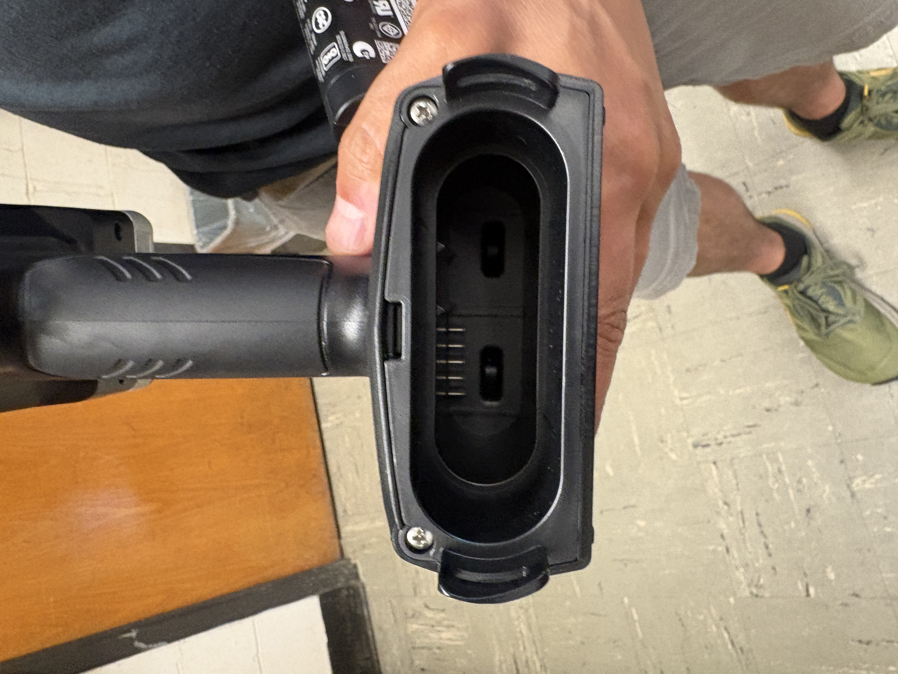
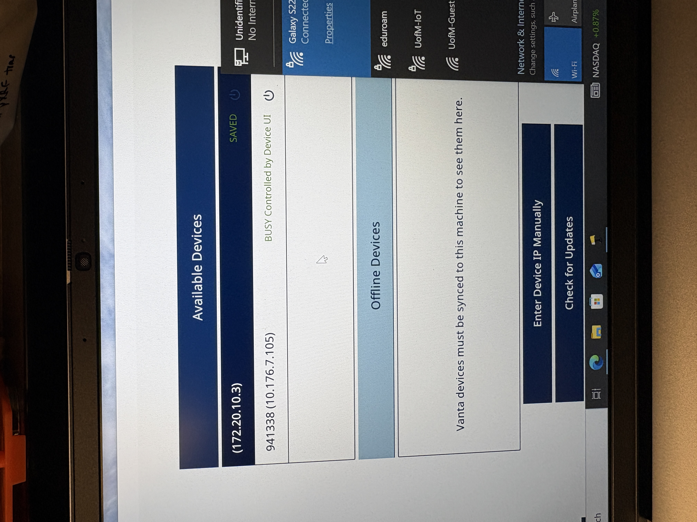
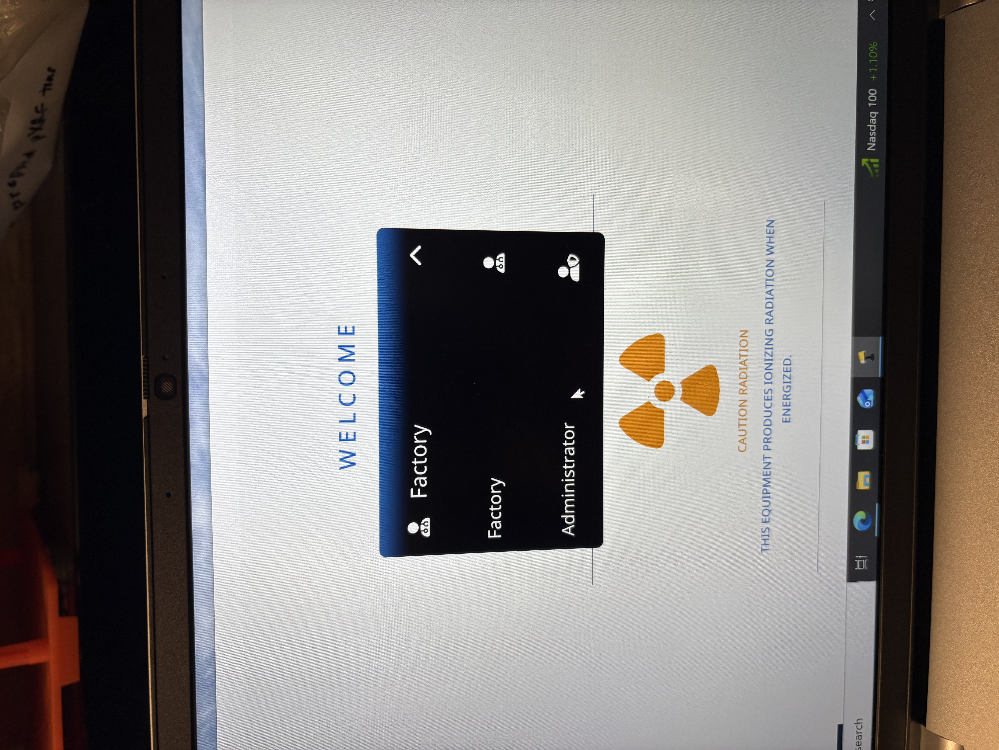
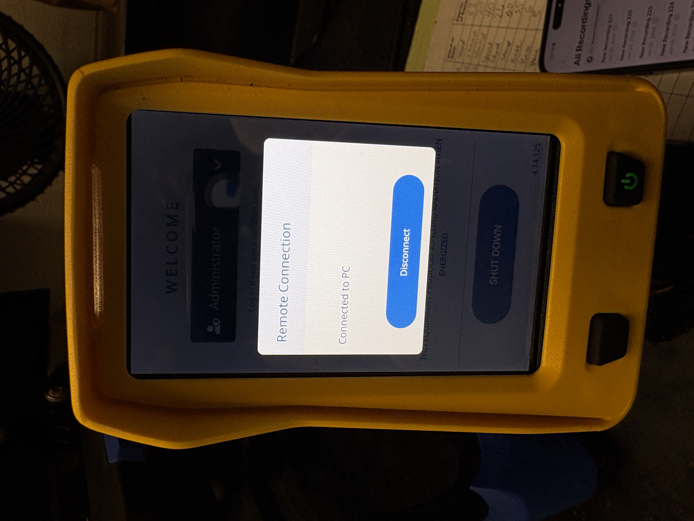
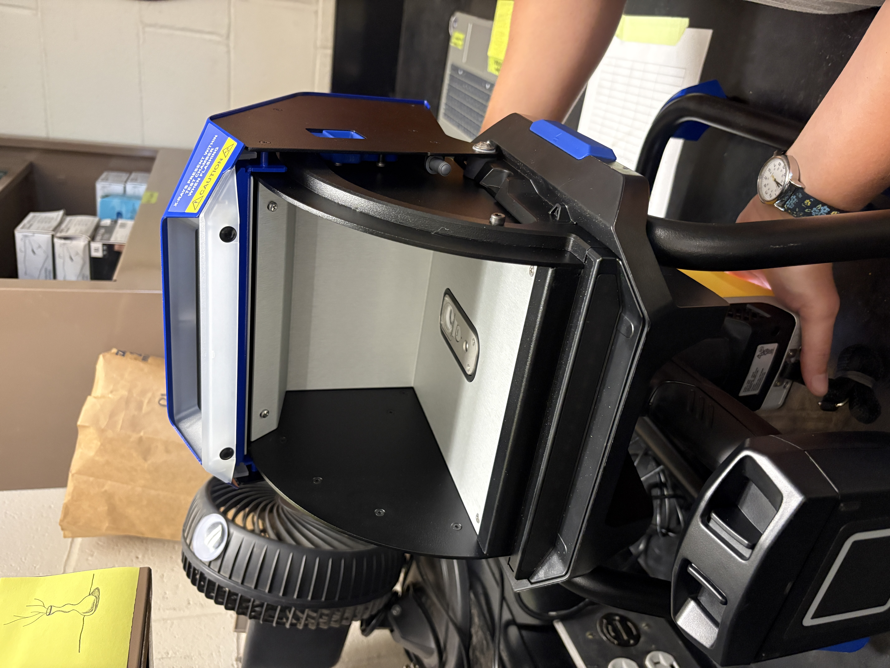
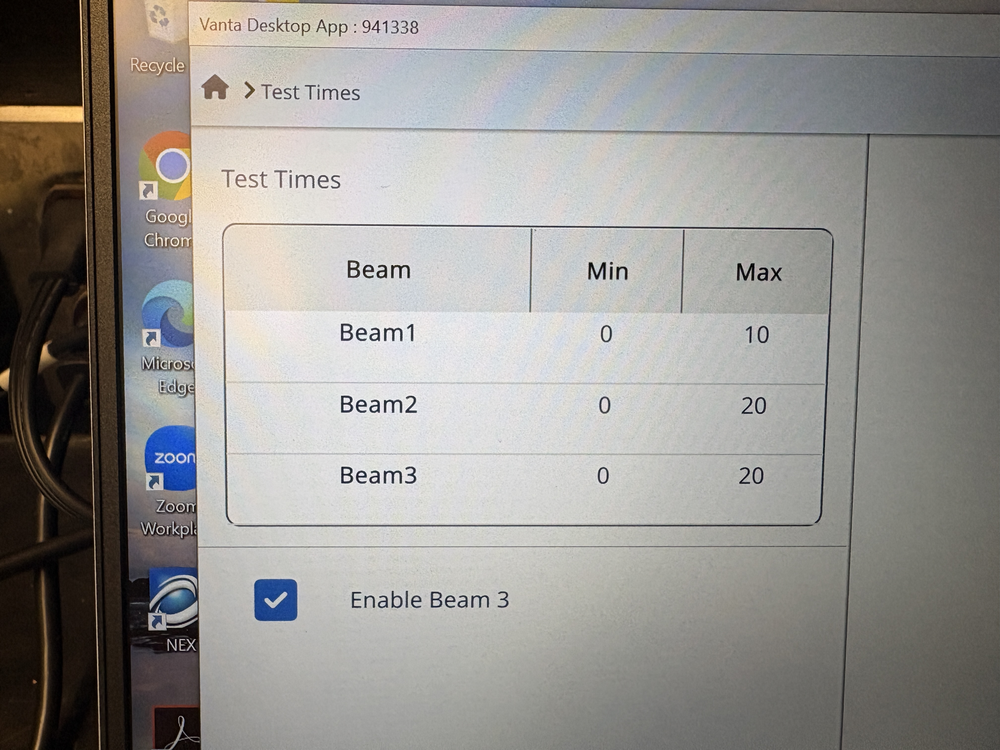
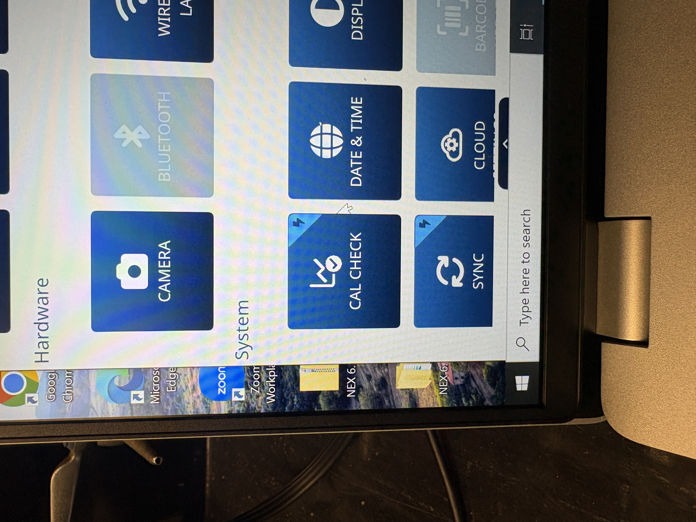
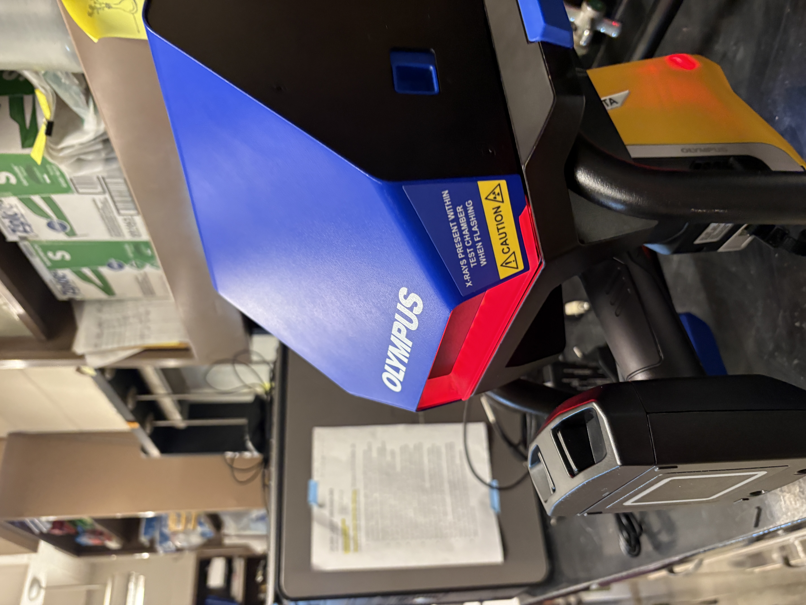
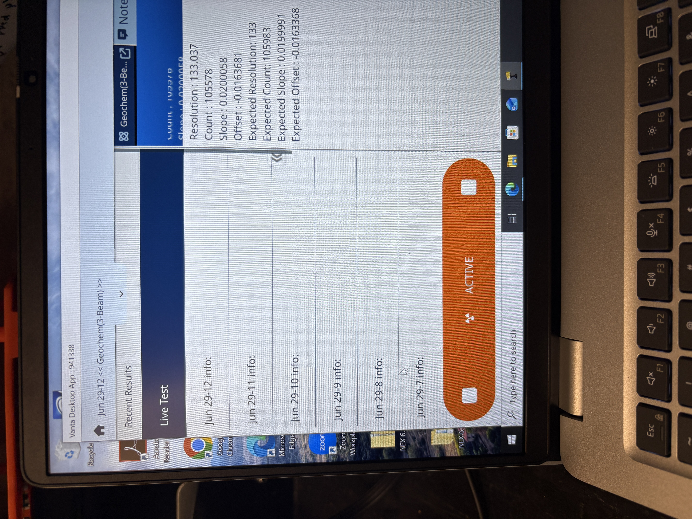
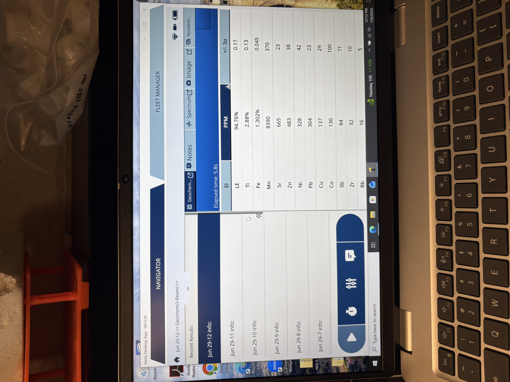

# pXRF (Olympus Vanta series)

::: callout-note
Last edited: 02SEP2026 NBP

Portable X-ray fluorescence (pXRF) is an estimate of elemental composition. This protocol is written for use with an **Olympus Vanta series pXRF**. Operating instructions for XRF use in the stand and in the field are included.

If you have not had training with Nic or Nora and do not have a dosimeter, then you cannot operate the pXRF. Nic will provide annual pXRF refresher trainings for all pXRF users.
:::

## Materials

- Soil samples, preferably dried and sieved to 2mm
- Dosimeter
- XRF with charged battery
- Calibration coin
- Stand or base
- Computer, if using stand

## Stand and Computer Use Operation

- Make sure you have your dosimeter on.
- Turn the computer on. Log in to .\JelinskiLab. Password is written on the computer.
- Connect the computer to the University of Minnesota IoT wifi. The password is written on the computer in case users are prompted to re-enter it, but the computer should recall it.
- Put a battery in the pXRF and turn on the device by pressing the power button on the right side of the face. Do not log in - JUST turn it on. To log out, press the arrow to open the menu and scroll down to logout session.

```{r, echo=FALSE, out.width="50%", fig.align="center", fig.cap="Figure 1. Battery port on Vanta pXRF. Line the pins on the battery up with the pins in the unit prior to inserting. The battery will click in when fully inserted."}

```

- Open Vanta2 software on the computer. Choose the pXRF from the list of available devices by double clicking. The device serial number will be displayed in front of the IP address when the computer and device are ready to be connected. The computer will not allow users to choose the pXRF from the list of available devices without the serial number being displayed. See Figure 2.
- Open the dropdown menu for the list of registered users. It will say Factory upon opening the software. Change it to Administrator and enter the password to log in (0000). See Figure 3.

::: callout-note
Username: Administrator Password: 0000
:::

```{r, echo=FALSE, out.width="50%", fig.align="center", fig.cap="Figure 2. List of available devices on Vanta software. Note that the pXRF serial number (941338) is listed on the second option; double click to open the measurement window."}

```

```{r, echo=FALSE, out.width="50%", fig.align="center", fig.cap="Figure 3. List of registered users on Vanta software. Choose Administrator and enter password."}

```

- Once signed in to the pXRF on the computer, the pXRF screen should read "Remote Connection - Connected to PC."

```{r, echo=FALSE, out.width="50%", fig.align="center", fig.cap="Figure 4. pXRF screen while controlled by Vanta software."}

```

- Connect the pXRF to the stand. The screen side should be down and the handle should be sticking towards the operator. It must latch into place before the operator lets go. The clips on the back of the stand will make an audible "click" noise when secured.

```{r, echo=FALSE, out.width="50%", fig.align="center", fig.cap="Figure 5. pXRF connected to stand. Note that measurement window is flush with bottom of stand."}

```


- The Vanta series pXRF uses the Olympus Geochem model, a 3-beam configuration. To change the scan time, open the dropdown menu and choose test times under the Method heading (Figure 6). Change the numbers for each beam individually by double clicking on the number in the Max column (Figure 7). The Jelinski lab's default is scanning for 10, 10, and 20 seconds under beams 1, 2, and 3 respectively. Users can change these values as they'd like, but the software will save the most recent values used. For that reason, **open the test times menu and double check each beam's test time each time the pXRF is used.** For consistency, samples from the same project should be scanned for the same length of time.


```{r, echo=FALSE, out.width="50%", fig.align="center", fig.cap="Figure 6. Vanta software menu, Methods section. Test times icon on far right."}
knitr::include_graphics("vanta-xrf6.JPG")
```


```{r, echo=FALSE, out.width="50%", fig.align="center", fig.cap="Figure 7. Test times window."}

```


- Insert the calibration coin (316 alloy) into the stand, making sure that it is centered over the screen. The coin is in the pXRF case. Most people place it blank side down (printed side up). Close the stand lid. On the computer, click the small dropdown arrow at the top of the screen to open the menu. Under the System heading, click Cal Check. This will begin the calibration check. Red lights will blink from the stand and pXRF to indicate that radiation is being produced. When the red light stops, calibration is complete. Place the calibration coin back in the bag.

```{r, echo=FALSE, out.width="50%", fig.align="center", fig.cap="Figure 8. Calibration check button in Vanta software drop down menu."}

```

```{r, echo=FALSE, out.width="50%", fig.align="center", fig.cap="Figure 9. pXRF and stand while running; note red lights (flashing)."}

```

```{r, echo=FALSE, out.width="50%", fig.align="center", fig.cap="Figure 10. Vanta software while running calibration check."}

```

- To scan samples, place one at a time in the stand. Shut the stand. Press the green play button on the lower left of the computer screen to scan. Prior to scanning, the computer will prompt the user to enter a sample name. Users will be unable to press the play button (and enter a sample name) with the stand door open, so remember the sample name prior to placing it in the stand.

- When scanning, the computer will update the elemental composition of the sample on the right side of the screen. The left side of the screen will display a list of previous samples run; clicking one will highlight it in navy blue and display its elemental composition. Results are displayed in parts per million (ppm). Above 10,000 ppm, the computer displays in percent, but all results are exported as ppm.

```{r, echo=FALSE, out.width="50%", fig.align="center", fig.cap="Figure 11. Vanta software after scanning soil sample. Results shown on right side of screen; showning sample Jun29-12, which is higlighted in navy blue on left."}

```

#### Exporting from the Stand

- When finished scanning, export samples from the Vanta2 software to the computer. Click the dropdown arrow to open the menu and choose Export Today to export all data scanned on the current day. A comma separated values file (.csv) will be saved in the pxrf-exports folder linked on the desktop.

- **Change the file name to your last name, today's date, and a project identifier.** For example, PEARSON-16JUL2026-TCMA.

- **Move the file into a folder within the pxrf-exports folder.** The pxrf-exports folder should be kept free of loose files. If the user is in the Jelinski lab, this should be a project-specific folder, such as tcma-soil-survey. If the user belongs to a different lab group, the folder should be the PI's name, i.e. Snell-Rood or Santelli.

- To export data from the PC, users can either use a flash drive or email themselves the file. There is a flash drive and USB-C adaptor in the pXRF supply drawer. Please return the flash drive and adaptor to the drawer.

- When done using the pXRF, open the menu on the Vanta2 software. Choose Logout Session. Quit the software.

- Remove the pXRF from the stand. Hold the handle and slide the blue switch on the back side of the stand to release the pXRF. If will fall onto the counter if unsupported; please hold it prior to releasing the switch.

- Press the power button on the pXRF to shut it down.

- Remove the battery from the pXRF. If it is low, plug it into the charger (found in the case) and leave it on the counter. Place the pXRF in the case and return it to the closet.

- **Disconnect the computer from the UMN IoT wifi.** This is critical. If the computer shuts down while connected to wifi, it will attempt to update when restarting for the next user and the Vanta2 software will not work. Disconnect the computer from the wifi prior to shutting it down. Once disconnected, shut down the computer.

- Return your dosimeter to the drawer.

## Field Operation

To be added.
